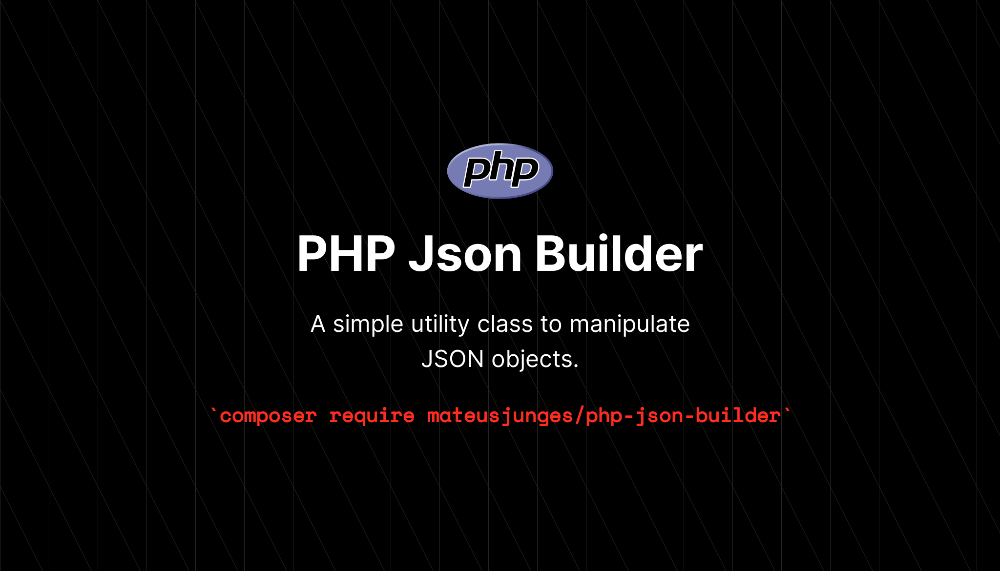

# PHP Json Builder
A simple utility class to manipulate JSON objects!



This package provides a simples class to centralize JSON operations into one object that can be shared across the application without the risk of memory duplication.

```php
use Junges\Json\Json;

$json = Json::make(['foo' => ['bar', 'baz']]);

$json->get('foo.bar'); // "baz"
```
It can be parsed into a collection using the `collect` method, and it is *iterable*:

```php
$collection = $json->collect()->map(fn ($item) => "$item is cool");

foreach ($json as $key => $item) {
    // ...
}
```

Of course, it also transforms to json when casting it to a string:
```php
use Junges\Json\Json;

$json = Json::make(['foo' => ['bar', 'baz']]);

(string) $json; // {"foo":{"bar":"baz"}}
```

# Sponsor my work!
If you think this package helped you in any way, you can sponsor me on GitHub!

[](https://github.com/sponsors/mateusjunges)

# Changelog
Please see the [changelog](CHANGELOG.md) for more information about the changes on this package.

# Tests
Run `composer test` to test this package.

# Credits
 - [DarkGhostHunter](https://github.com/darkghosthunter)
 - [All contributors](https://github.com/mateusjunges/php-json-builder/graphs/contributors)